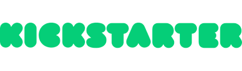

# Final Project - KICKSTARTER

Kickstarter is a funding platform for creative projects. Everything from film, games, and music to art, design, and technology. Kickstarter is full of ambitious, innovative, and imaginative projects that are brought to life through the direct support of others.

Every project creator sets their project's funding goal and deadline. If people like the project, they can pledge money to make it happen. If the project succeeds in reaching its funding goal, all backers' credit cards are charged when time expires. Funding on Kickstarter is all-or-nothing. If the project falls short of its funding goal, no one is charged.

## Objective

The goal  is to be able to predict whether or not a project will receive it's goal funds.

## Data

describe data etc.

### Data Source

The data has been extracted via apify downloads from kickstarter.

### Shape of the Data

Before cleaning the dataframe consisted of 543.589 rows and 39 columns. 
After cleaning the dataframe used for EDA and model consisted of 184.554 rows and 26 columns.

Here is and overview of the columns used for EDA and model:

| Column name | Description |
| ----------- | ----------- |
| backers_count | count of people backing the project |
| converted_pledged_amount | short description of the project |
| country_displayable_name | amount of money pledged |
| goal | country full name |
| state | categoryId |
| category_name | categoryId |
| category_analytics_name | name of category |
| category_slug | name of subcategory |
| category_parent_name | amount of money pledged |
| created_at_date | country |
| created_at_time | country full name |
| created_at_weekday | timestamp of when the project was created |
| launched_at_date | formatted created |
| launched_at_time | e |
| launched_at_weekday | e |
| deadline_date | e |
| deadline_time | e |
| deadline_weekday | e |
| project_duration | e |
| funded_rate | e |
| blurb_language | e |
| description | goal amount |
| description_pol | project id |
| description_sub | e |
| description_len | timestamp of when the project was launched |
| description_kw | e |

### Workflow

## Python Libraries
- [pandas](https://pandas.pydata.org/)
- [numpy](https://numpy.org/)
- [seaborn](https://seaborn.pydata.org/)
- [matplotlib](https://matplotlib.org/)
- [statsmodels](https://www.statsmodels.org/stable/index.html)
- [scipy](https://www.scipy.org/)
- [sklearn](https://scikit-learn.org/stable/)

### Libraries use for NLP
- [textblob](https://textblob.readthedocs.io/en/dev/)
- [yake](https://pypi.org/project/yake/)
- [langid](https://pypi.org/project/langid/1.1.2dev/)
- [rake-nltk](https://pypi.org/project/rake-nltk/)